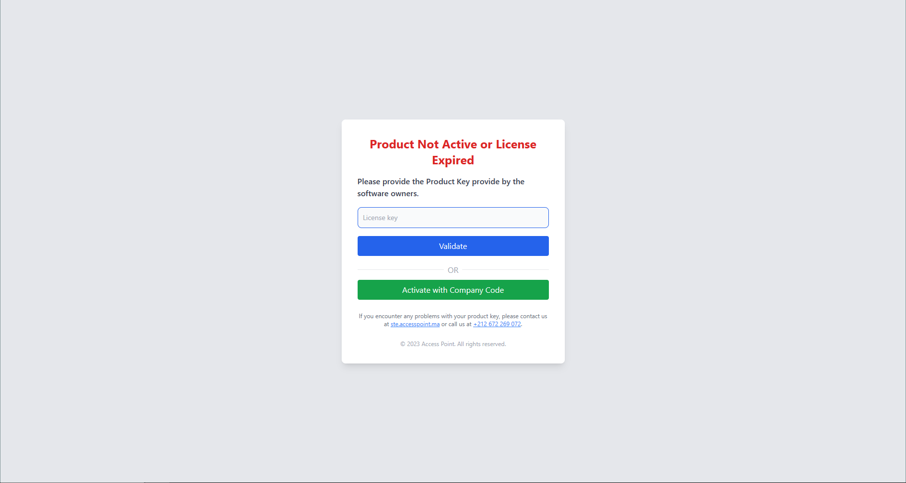

# Lamine License

A simple license generator for your projects. Made by [Lamine omar](https://github.com/omarlamin01).

## Installation

```bash
composer require lamine/license
```

## Usage

### 1. Setup the environment variables

Make sure to set the 'APP_NAME' in your .env file.

```bash
APP_NAME="Your App Name"
```

Then add this variables to your .env file. These variables will be used to generate the license. Otherwise the license will not be generated.

```bash
COMPANY_URL="https://www.yourwebsite.com/"
COMPANY_NAME="Your Company Name"
COMPANY_MAIL="your-company@email.com"
COMPANY_PHONE="+212 6 00 00 00 00"
```

Important: Make sure that the 'COMPANY_URL' variable ends with a slash. And leads to a valid url that contains your licensing system backend.

### 2. Run Migration

```bash
php artisan migrate
```

This command will create the tables license & timestamps in your database. These tables will be used to store the licenses.

### 3. setup your home route

```php
Route::get('/', function () {

    if (Index::validateLicense()) {
        return view('welcome');
    } else {
        return view('License::LicenseExpired');
    }
})->name('home');
```

Or If you are using Inertia, you can do this:

```php
public function index()
{
    if (Index::validateLicense()) {
        return Inertia::render('Auth/Login');
    } else {
        return view('License::LicenseExpired');
    }
}
```

### 4. Add middleware to your routes

Go to your 'app/Http/Kernel.php' file and add the middleware to your routes.

```php
protected $routeMiddleware = [
        .
        .
        .
        'license-api' => \Lamine\License\Middleware\ApiWare::class,
        'license-web' => \Lamine\License\Middleware\WebWare::class,
    ];
```

Then add the middleware to your routes.

`` routes/web.php ``

```php
Route::group(['middleware' => ['license-web']], function () {
    // all your web routes here
});
```

`` routes/api.php ``

```php
Route::group(['middleware' => ['license-api']], function () {
    // all your api routes here
});
```

### 5. Setup the 'app/console/Kernel.php' file

Add this line to the 'schedule' function in your 'app/console/Kernel.php' file.

```php
// check license every week
$schedule->call([Index::class, 'checkLicense'])->weekly();

// check time every hour
$schedule->call(function () {
    app()->call([TimeChecker::class, 'checkTime']);
})->hourly();

// truncate timestamps table every 24 hours
$schedule->call(function () {
    TimeChecker::truncateTimestamps();
})->daily();
```

After finishing all the steps, run development server.

```bash
php artisan serve
```

And go to the home page. If everything is ok, you will see the license expired page.



In this page you can activate your license either by entering the license key or by using a secret key of your company.
